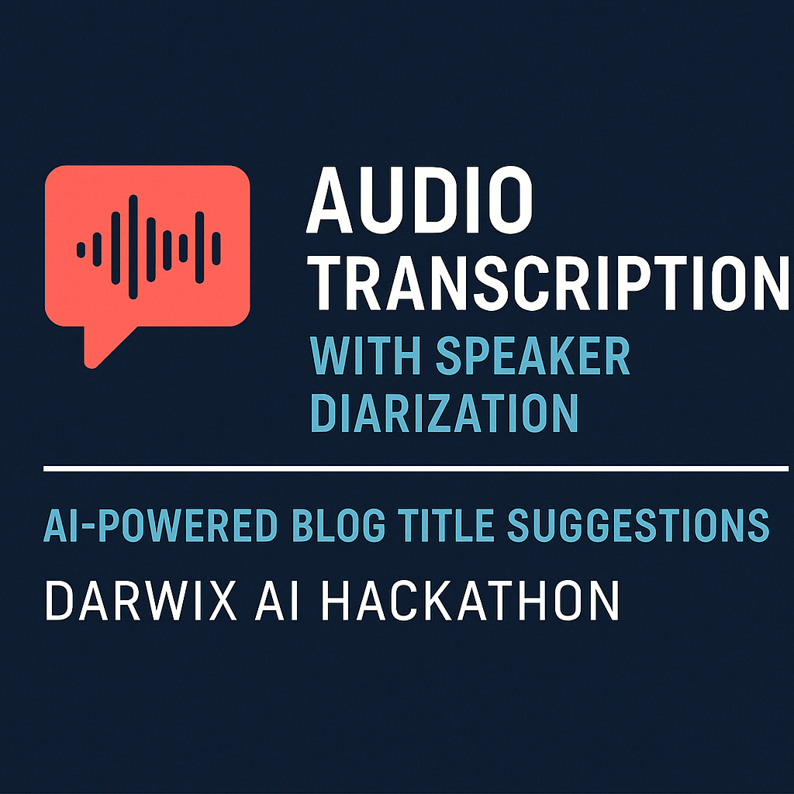
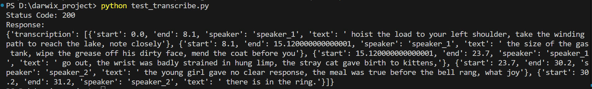
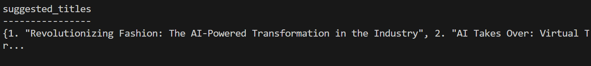

<h1 align="center">Darwix AI Hackathon Submission</h1>

<p align="center">
  
</p>

<p align="center">
  
</p>

<p align="center">
  
  
</p>


Welcome to the submission for the **Darwix AI Hackathon**!  
This project showcases the integration of **AI-powered transcription with speaker diarization** and **LLM-based blog title generation** inside a clean Django backend application.

---

##  Features at a Glance

| Feature                            | Description                                                                 |
|------------------------------------|-----------------------------------------------------------------------------|
| 🎙️ Audio Transcription             | Transcribe audio files into text using Whisper.                             |
| 🧑‍🤝‍🧑 Speaker Diarization           | Identify "who spoke when" with Resemblyzer.                                 |
| 📝 Blog Title Suggestions          | Generate catchy blog titles using OpenRouter's Mistral-7B model.            |
| 🔐 Secure API Key Management       | Secrets stored using environment variables and `python-dotenv`.             |
| 🚀 REST API Integration            | Easy-to-use API endpoints with clean JSON responses.                        |

---

## 🛠 Technologies Used

- **Python 3.10**
- **Django 5.2**
- **Django REST Framework**
- **faster-whisper** for transcription
- **Resemblyzer** for speaker diarization
- **OpenAI (OpenRouter)** for LLM integration
- **pydub**, **ffmpeg**, **requests**

---

##  Setup Instructions

###  Environment Setup

```bash
git clone https://github.com/rishi02102017/Darwix-AI-Hackathon.git
cd Darwix-AI-Hackathon

# Create virtual environment
python -m venv venv
venv\Scripts\activate  # On Windows

# Install dependencies
pip install -r requirements.txt

# Set up your environment variables
cp .env.example .env
```

Edit the `.env` file and add your OpenRouter API key:
```
OPENAI_API_KEY=your_openrouter_key_here
```

---

###  Run the Django App

```bash
python manage.py migrate
python manage.py runserver
```

You should see:
```
Starting development server at http://127.0.0.1:8000/
```

---

##  API Usage Guide

###  /transcribe/ (POST)

Upload a `.wav` file and get a transcript with speaker labels.

- **Content-Type**: `multipart/form-data`
- **Param**: `audio` (file)

**Sample Response:**
```json
{
  "transcription": [
    {
      "start": 0.0,
      "end": 8.1,
      "speaker": "speaker_1",
      "text": "Hello, how are you?"
    },
    {
      "start": 8.2,
      "end": 15.0,
      "speaker": "speaker_2",
      "text": "I'm great! You?"
    }
  ]
}
```

---

###  /suggest-titles/ (POST)

Suggest 3 catchy titles based on blog content.

- **Content-Type**: `application/json`
- **Body**:
```json
{
  "content": "This blog explores how AI is transforming the fashion industry..."
}
```

**Sample Response:**
```json
{
  "suggested_titles": [
    "1. Fashion Forward: How AI is Redefining Style",
    "2. AI in Vogue: Virtual Try-Ons and Smart Styling",
    "3. The Future of Fashion: Personalized by AI"
  ]
}
```

---

##  Testing

Use this script to test `/transcribe/` via Python:

```python
# test_transcribe.py
import requests

url = "http://127.0.0.1:8000/transcribe/"
with open("sample.wav", "rb") as f:
    r = requests.post(url, files={"audio": f})
print(r.status_code)
print(r.json())
```

---

## 📁 Folder Structure

```
darwix_project/
├── core/
│   ├── views.py
│   ├── urls.py
│   ├── __init__.py
├── darwix_ai_app/
│   └── settings.py
├── test_transcribe.py
├── manage.py
├── .env.example
├── .gitignore
├── OSR_us_000_0013_8k   .wav audio file
├── OSR_us_000_0010_8k   .wav audio file

```

---

## 📸 Screenshots

####  Sample Output – Multi-Speaker Transcription
Below is a screenshot showing the diarized transcription response from `/transcribe-audio/`:




####  Sample Output – Suggested Titles
Below is a screenshot of the generated blog titles using the `/suggest-titles/` endpoint:




---

## 📌 Tips & Notes

- Use [https://openrouter.ai](https://openrouter.ai) to get a free OpenAI-compatible API key.
- Make sure `ffmpeg` is installed and available in PATH for `pydub` to work.
- For best diarization, use clean `.wav` files with sample rate ~16kHz.

---

## 👨‍💻 Author

**Jyotishman Das**  
M.Tech Artificial Intelligence – IIT Jodhpur  

- [Portfolio](https://my-portfolio-jyotishman-das-projects.vercel.app)  
- [LinkedIn](https://www.linkedin.com/in/jyotishmandas85p/)

---

## Submission Checklist

- [x] Audio Transcription Endpoint
- [x] Speaker Diarization
- [x] Title Generation Endpoint
- [x] Test Scripts
- [x] `.env` secured
- [x] Ready-to-run README

---

